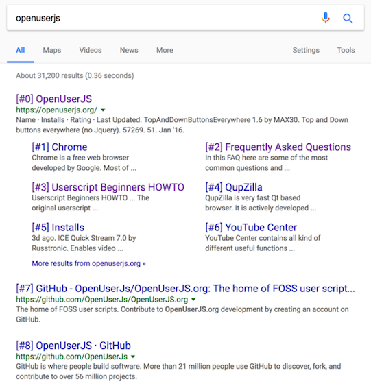

## Google Sharp
Prefix google search results with `#n` for direct links

Also available [here](https://openuserjs.org/scripts/ryenus/Google_Sharp) on OpenUserJS.org

## Note
Just for those behind the infamous GFW.

## Screenshot

## Prerequisites
Make sure you have necessary add-ons installed for your browser:

| Extensions / Add-ons | Supported Browsers |
| --- | --- |
| [TamperMonkey](https://tampermonkey.net/) | Chrome, Microsoft Edge, Safari, Opera Next, and Firefox. |
| [GreaseMonkey](http://www.greasespot.net/) | FireFox |

## License

[The MIT License](https://opensource.org/licenses/MIT).
